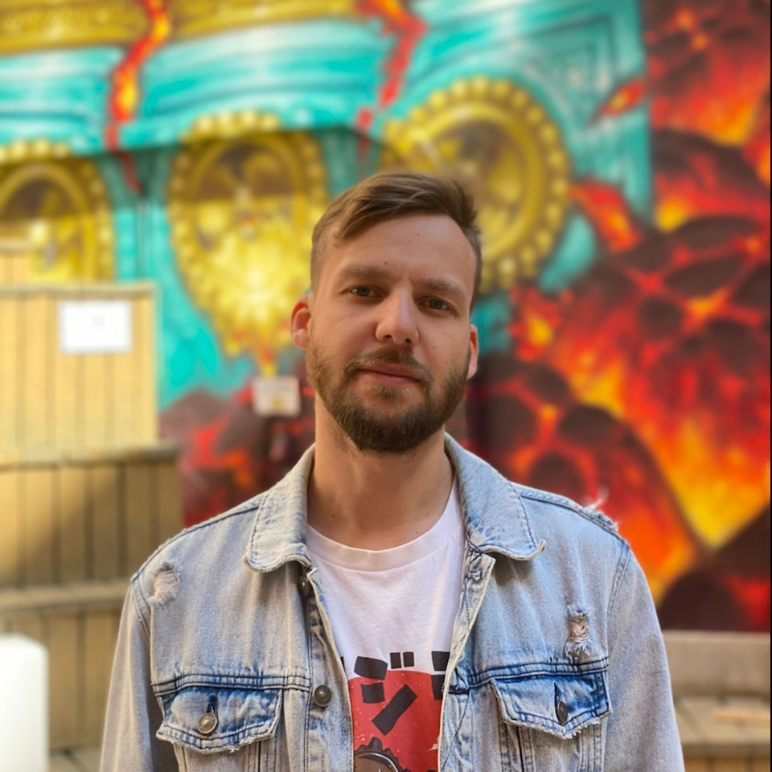

# Привет, меня зовут Данила

Я фронтенд разработчик из Санкт-Петербурга. Опыт работы более одного года. Помимо программирования увлекаюсь UI дизайном и мобильными технологиями.

Имею навыки разработки вэб-приложений, используя следующие технологии:
- HTML5
- CSS3 (SASS, LESS)
- JavaScript
- React
- Webpack
- Git

